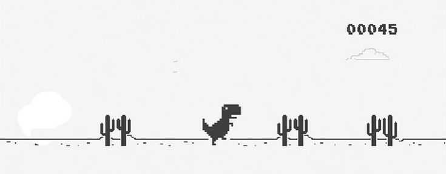

  
## ✦ VEENUS MALIK ✦

  

<i>Always learning. Always building.</i>

  

  

  

  

  

  

### ✦ ABOUT ✦

 **BS in Data Science @ IIT Madras**

I'm a full-stack developer passionate about building clean, scalable, and user-friendly applications. I enjoy solving real-world problems through software, continuously strengthening my skills in data structures, backend development, and open-source collaboration while always exploring better ways to learn and create.

  

<h2 align="center">✦ TECH STACK ✦</h2>

<table height="150%" width="650%">
<tr>
<th height="40%" width="50%">💻 Category</th>
<th height="40%" width="450%">⚙️ Technologies</th>
</tr>

<tr>
<td align="center"><b>Languages</b></td>
<td align="center">

</td>
</tr>

<tr>
<td align="center"><b>Frontend</b></td>
<td align="center">

</td>
</tr>

<tr>
<td align="center"><b>Backend</b></td>
<td align="center">

</td>
</tr>

<tr>
<td align="center"><b>Tools</b></td>
<td align="center">

</td>
</tr>

</table>

  

### ✦ GITHUB ACTIVITY ✦

  

  

  

  

### ✦ See you in the next commit ✦

